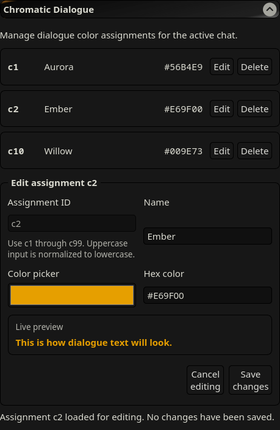
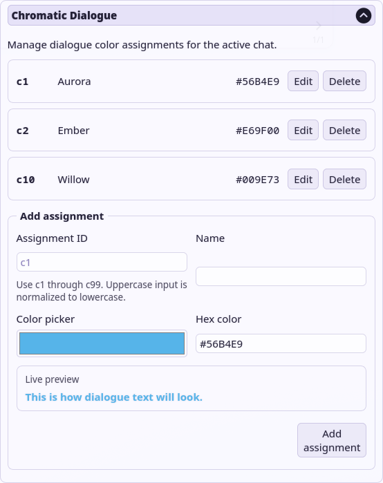
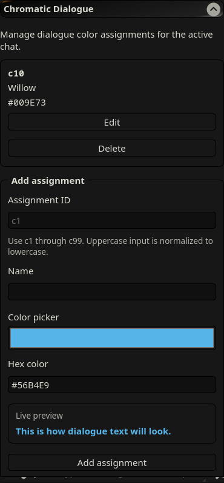

# Chromatic Dialogue

Chromatic Dialogue is a lightweight, chat-scoped dialogue color manager for
[SillyTavern](https://github.com/SillyTavern/SillyTavern). It associates compact
markers such as `[c1]...[/c]` with colors that you manage from the Extensions
panel.

Version `0.1.0` is the first public MVP. It manages assignments and generated
CSS only: SillyTavern's built-in Regex extension performs the display
transformation. Stored messages keep their compact markers, and outgoing
prompts are not changed.

## Features

- Independent `c1` through `c99` assignments for every chat.
- Add, edit, delete, and reuse assignments without editing JSON or CSS.
- Immediate color updates through one deterministic generated style element.
- Automatic refresh when the active chat changes.
- Uppercase assignment input normalized to canonical lowercase storage.
- Trimmed Unicode names with no arbitrary length limit.
- Six-digit hexadecimal colors normalized to uppercase.
- Responsive, keyboard-accessible controls with in-panel operation status.
- No polling, message scanning, streaming interception, runtime dependencies,
  or build step.

Chromatic Dialogue does not install or modify Regex scripts, rewrite messages
or prompts, choose colors automatically, or provide inherited defaults,
AI-generated proposals, import/export, localization, or special group-chat
semantics in `0.1.0`.

## Requirements

- SillyTavern `1.18.0` or newer.
- SillyTavern's built-in Regex extension.
- A Global Regex script configured according to the
  [built-in Regex setup guide](docs/regex-setup.md).

## Installation

1. Open SillyTavern's **Extensions** panel.
2. Select **Install Extension**.
3. Enter this repository URL:

   ```text
   https://github.com/zNe4/SillyTavern-ChromaticDialogue
   ```

4. If SillyTavern offers a current-user or all-users installation choice,
   choose the scope appropriate for your installation. Chromatic Dialogue
   behaves the same in either scope.
5. Complete the installation and reload SillyTavern.
6. Open **Extensions -> Chromatic Dialogue**.

The default GitHub branch is the normal installation source. A separate ZIP,
npm package, installer, or server plugin is not required.

### Updating, disabling, and uninstalling

- Use SillyTavern's Extension Manager update action for the installed
  extension, then reload SillyTavern.
- Disabling and re-enabling the extension does not intentionally alter stored
  chat assignments. Reload if the panel or rendered styles do not immediately
  reflect the new enabled state.
- Removing the extension files stops the panel and generated colors, but
  Chromatic Dialogue has no uninstall hook that erases chat metadata. If you
  also want to remove saved mappings, delete them from each relevant chat
  before uninstalling.
- Reinstalling or updating must never require manual editing of chat files.

## Required Regex setup

Chromatic Dialogue supplies colors for HTML classes; the built-in Regex script
creates those classes in the rendered chat. Follow the
[complete setup guide](docs/regex-setup.md) before testing colors.

The essential Regex replacement transforms:

```text
[c1]Good morning.[/c]
```

to this display-only HTML source:

```html
<span class="cd-c1">“Good morning.”</span>
```

When SillyTavern renders the chat, it automatically prefixes the class with
`custom-`. The resulting DOM class is `custom-cd-c1`, which is what Chromatic
Dialogue's generated CSS targets. Do not add `custom-` manually in the Regex
replacement.

The raw `[c1]...[/c]` text remains in chat storage and in conversation history
sent to the model. **Alter Outgoing Prompt** must remain disabled in the Regex
script.

## Quick start

1. Open or create a chat.
2. Open **Extensions -> Chromatic Dialogue**.
3. Enter an unused ID such as `c1`, a character name, and a six-digit color
   such as `#56B4E9`.
4. Select **Add assignment**.
5. Make sure the required Global Regex script is enabled.
6. Use the corresponding lowercase marker in an AI response:

   ```text
   [c1]This dialogue uses the c1 color.[/c]
   ```

The assignment takes effect immediately. It is saved only in the active chat
and is restored when that chat is reopened.

## Screenshots

These authentic captures use disposable assignments and show the extension's
desktop and narrow responsive layouts.

### Desktop edit — Dark Lite



### Desktop add — Violet Glass Light



### Narrow responsive layout — Dark Lite



## Writing dialogue markers

Use lowercase IDs from `c1` through `c99`.

One dialogue segment:

```text
[c1]Good morning.[/c]
```

Multiple speakers with narration outside the markers:

```text
[c1]We should leave before sunset.[/c]

Daniel checks the road ahead.

[c2]Then we should go now.[/c]
```

Multiline dialogue:

```text
[c1]The first line remains part of the dialogue.
So does the second line.[/c]
```

The assignment form tolerates `C1` or surrounding whitespace and stores `c1`.
The Regex marker protocol itself is case-sensitive, so write `[c1]`, not
`[C1]`.

Invalid examples include `c0`, `c01`, `c100`, arbitrary class names, nested
markers, and a marker without a closing `[/c]`.

## Managing assignments

### Add

Enter an unused ID, a non-empty name, and a color in `#RRGGBB` form. Names are
trimmed but otherwise preserve Unicode and long text. Colors such as `#56b4e9`
are stored and displayed as `#56B4E9`. Duplicate IDs are rejected after ID
normalization.

### Edit

Select **Edit**, change the name or color, and select **Save changes**. The ID
is immutable while editing. **Cancel editing** exits without saving.

### Delete and reuse

Select **Delete** and confirm the prompt. Deletion affects only that assignment
in the active chat. The deleted ID can then be added again with a new name or
color.

Successful operations update the assignment list and dialogue styles and
produce an accessible status message inside the panel.

## Chat scope, reloads, and switching

Assignments are stored under schema version 1 in the active chat's metadata.
Two chats may use the same ID for different names and colors. Switching chats
replaces both the table and generated CSS with the newly active chat's state.

A browser reload reconstructs assignments from the current chat. Chromatic
Dialogue never copies assignments between chats and never changes the raw
message text or outgoing prompt.

## Max Depth and streaming

Use Min Depth `0` and Max Depth `50` as the balanced recommended Regex setup.
Messages older than Max Depth can show their raw `[cN]...[/c]` markers because
the display Regex is no longer applied to them. Choose **Unlimited** when you
want the entire visible transcript formatted; this is a user-managed Regex
setting, not a mobile default enforced by Chromatic Dialogue.

During streaming, an opening marker or partial dialogue may remain temporarily
visible. It transforms after the complete valid closing `[/c]` arrives.

## Missing or disabled Regex

If the Regex script is absent, disabled, outside its configured depth, or set
not to alter chat display, Chromatic Dialogue still loads safely. Assignments
remain stored, but the chat shows raw compact markers instead of colored
dialogue. Re-enable or correct the Regex script; do not edit stored messages to
replace the markers with HTML.

## Current limitations

- Marker syntax is lowercase and supports only `c1` through `c99`.
- Nested markers are invalid; narration and actions belong outside markers.
- The supplied Regex inserts fixed curly quotation marks. Chromatic Dialogue
  can color nested `<q>` elements created by SillyTavern, but it does not choose
  or rewrite quote glyphs.
- Colors are user-selected; automatic contrast checking and palette generation
  are planned post-MVP work.
- There are no character/global inherited defaults, import/export, AI proposal
  handling, toolbar shortcut, localization, or special group semantics yet.
- Firefox desktop, Firefox responsive layouts, and Opera on physical Android
  have been accepted. Chromium desktop remains explicitly unverified because
  it was unavailable in the test environment; this is not a known
  incompatibility claim.

## Troubleshooting

| Symptom | Check |
| --- | --- |
| Raw `[cN]...[/c]` markers | Enable the Global Regex script; confirm **AI Response**, **Alter Chat Display**, the exact Find/Replace values, and the message's depth. |
| Older messages show raw markers | Increase Max Depth or choose **Unlimited** in the Regex script. |
| Marker remains raw while streaming | Wait for the complete closing `[/c]`; incomplete markers do not match. |
| Dialogue has the wrong or no color | Open the relevant chat, confirm its `cN` assignment, use a lowercase marker, verify that **Replace With** uses `cd-c$1`, and confirm SillyTavern renders the resulting class as `custom-cd-cN`. |
| Assignment ID is rejected | Use `c1` through `c99`; `c0`, `c01`, and `c100` are invalid. Uppercase is accepted only as assignment-form input. |
| Form is disabled | Open or create a supported chat before managing assignments. |
| Chromatic Dialogue panel is missing | Confirm the extension is installed and enabled, reload SillyTavern, and reopen the Extensions panel. |
| State looks stale after an update or reload | Reload once, reopen the intended chat, and verify that the panel and markers use that chat's assignments. |
| Operation reports a failure | Preserve the in-panel message and inspect the browser console for a new `[Chromatic Dialogue]` error. Do not include private chat text, API details, or credentials when sharing evidence. |

For Regex-specific diagnosis, use the verification and troubleshooting steps in
[docs/regex-setup.md](docs/regex-setup.md).

## Local development

Chromatic Dialogue uses native JavaScript ES modules, HTML, and CSS. It has no
build step and no third-party runtime dependencies, so `npm install` is not
required for the current project.

Clone and test an isolated development copy:

```bash
git clone https://github.com/zNe4/SillyTavern-ChromaticDialogue.git
cd SillyTavern-ChromaticDialogue
npm test
```

For a direct development checkout, clone the repository as
`SillyTavern-ChromaticDialogue` inside the applicable SillyTavern
`public/scripts/extensions/third-party/` directory, then reload SillyTavern.
Avoid keeping two enabled copies of the extension in the same installation.

The baseline suite contains 53 tests. It covers domain normalization,
chat-scoped persistence and rollback, generated CSS, lifecycle behavior,
accessible panel controls, add/edit/delete operations, ID reuse, rapid chat
switching, reload reconstruction, boundary and invalid IDs, Unicode and long
names, nested quote coloring, and the absence of message-DOM traversal.

Run a syntax check for every JavaScript/MJS file with:

```bash
find . -type f \( -name '*.js' -o -name '*.mjs' \) -print0 \
  | sort -z \
  | xargs -0 -n1 node --check
```

## Project structure

```text
.
├── docs/
│   └── regex-setup.md
├── scripts/
│   └── archive-project.sh
├── src/
│   ├── chat-store.js
│   ├── constants.js
│   ├── domain.js
│   ├── panel.js
│   ├── style-manager.js
│   └── style-runtime.js
├── tests/
│   └── *.test.mjs
├── CHANGELOG.md
├── global.d.ts
├── index.js
├── manifest.json
├── package.json
├── roadmap.md
├── settings.html
└── style.css
```

Release history is recorded in [CHANGELOG.md](CHANGELOG.md).

## License

Chromatic Dialogue is licensed under the
[GNU Affero General Public License v3.0](LICENSE).
