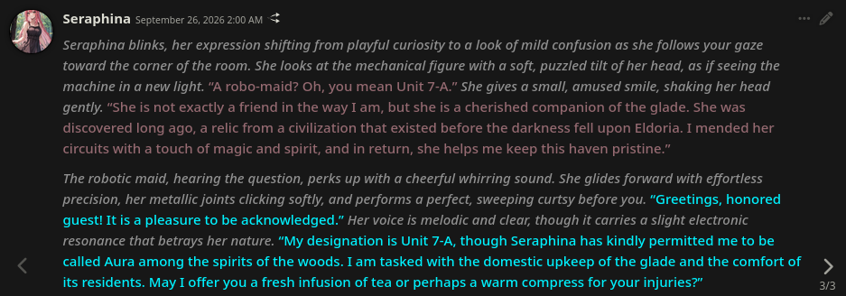
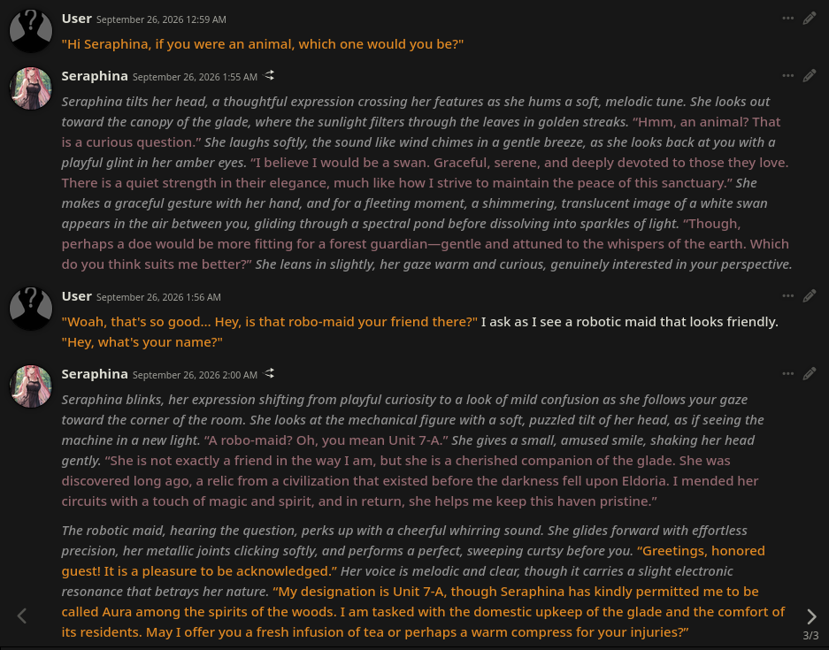
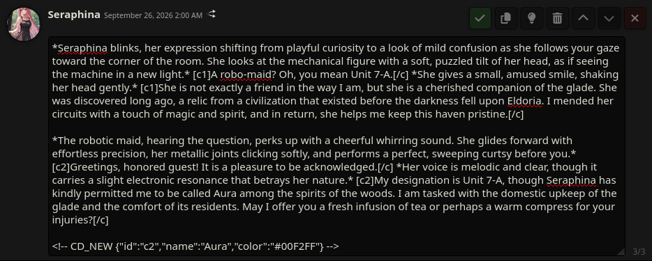
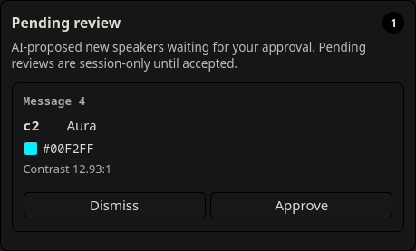
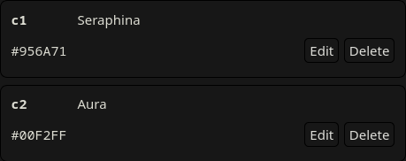
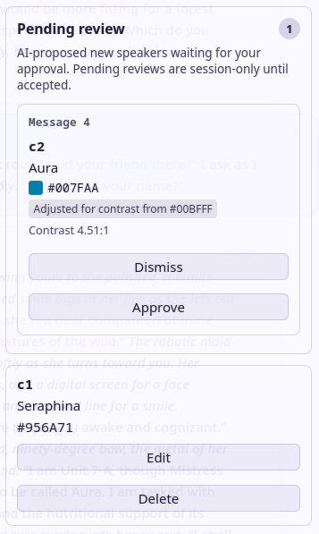
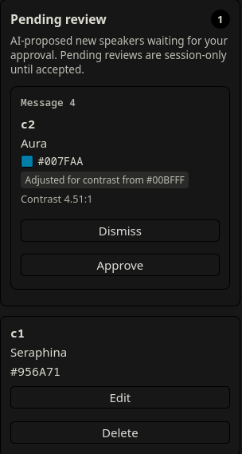

# Chromatic Dialogue

Chromatic Dialogue is a chat-scoped dialogue color and speaker-registration extension for [SillyTavern](https://github.com/SillyTavern/SillyTavern). It uses compact markers such as `[c1]...[/c]`, per-chat character assignments, and SillyTavern's built-in Regex extension to render recurring speakers with consistent colors.

Version `1.0.1` is the current stable release. It keeps the complete `1.0.0` feature set — including automatic contrast correction — and adds compatibility with SillyTavern presets that append auxiliary/non-story content after Chromatic Dialogue registration records.

## Features

- Independent `c1` through `c99` character assignments for every chat.
- Manual add, edit, delete, and ID reuse from the Extensions panel.
- Four prompt macros for compact AI state: `{{cdCount}}`, `{{cdNext}}`, `{{cdRoster}}`, and `{{cdState}}`.
- AI proposal protocol using a contiguous block of one-line `<!-- CD_NEW {...} -->` records, compatible with auxiliary preset output that follows the registration block.
- Three per-chat operation modes:
  - **Off** — ignore future new-character proposals.
  - **Review** — require manual approval or dismissal.
  - **Automatic** — safely auto-register valid proposals and leave uncertain/conflicting cases pending for manual review.
- Atomic handling of several new characters introduced by one assistant message.
- First-success-wins protection for competing proposals.
- WCAG-style minimum contrast adjustment against the current chat background.
- Immediate generated CSS refresh when assignments or the active chat change.
- Strict-write metadata hardening with tolerant reads for older/corrupt data.
- Optional per-utterance dialogue tones — `whisper`, `shout`, `measured`, and `tremble` — while ordinary `[cN]...[/c]` dialogue remains fully supported.
- Native SillyTavern Regex for display formatting and outgoing-prompt cleanup; stored chat text is never rewritten by Chromatic Dialogue.
- Responsive, keyboard-accessible panel controls with no build step or external runtime dependency.

Chromatic Dialogue does **not** install or edit Regex scripts automatically, rewrite raw assistant messages, persist unresolved Review cards, or use a separate custom chat-rendering engine.

## Requirements

- SillyTavern `1.18.0` or newer, matching the extension manifest.
- SillyTavern's built-in Regex extension.
- The two Regex responsibilities described in the [Regex setup guide](docs/regex-setup.md).
- For AI-managed speakers, the formatting/registration prompt from the [AI prompt guide](docs/ai-prompt.md).

## Installation

1. Open SillyTavern's **Extensions** panel.
2. Select **Install Extension**.
3. Enter this repository URL:

   ```text
   https://github.com/zNe4/SillyTavern-ChromaticDialogue
   ```

4. Complete the installation and reload SillyTavern.
5. Open **Extensions -> Chromatic Dialogue**.
6. Complete the one-time Regex setup below.
7. If you want AI-managed character registration, add the recommended Chromatic Dialogue prompt to a SillyTavern prompt field where custom macros are expanded.

The default GitHub branch is the normal installation source. A separate npm package, installer, or server plugin is not required.

### Updating, disabling, and uninstalling

- Use SillyTavern's Extension Manager update action, then reload when the Extension Manager requests it.
- Disabling the extension does not intentionally erase committed chat assignments or saved per-chat mode data.
- Removing the extension files stops the panel and generated colors, but there is no uninstall hook that deletes Chromatic Dialogue metadata from existing chats.
- Reinstalling or updating should not require manual editing of chat files.

## One-time setup

Chromatic Dialogue deliberately separates three jobs:

1. **Display Regex** — renders ordinary `[cN]...[/c]` and optional `[cN:tone]...[/c]` dialogue in the chat display. The supported tones are `whisper`, `shout`, `measured`, and `tremble`.
2. **Prompt-hygiene Regex** — removes internal `CD_NEW` registration comments from later outgoing LLM prompts while leaving stored messages intact.
3. **AI formatting prompt** — tells the model how to reuse existing IDs and propose genuinely new speakers.

Follow the [complete Regex setup guide](docs/regex-setup.md), then copy the [recommended AI prompt](docs/ai-prompt.md) if you want Review or Automatic registration.

The unified display Regex transforms ordinary dialogue such as:

```text
[c1]Good morning.[/c]
```

and optional toned dialogue such as:

```text
[c1:whisper]Keep your voice down.[/c]
```

into display-only spans that keep the `cd-c1` character class separate from the optional `cd-tone-*` presentation class. SillyTavern exposes these as `custom-cd-c1` and, when present, classes such as `custom-cd-tone-whisper`. Character color remains owned by `custom-cd-c1`; tone changes typography only. The raw markers stay in chat storage and in normal conversation history sent to the model.

The separate prompt-hygiene Regex removes only one-line `<!-- CD_NEW ... -->` control records from subsequent outgoing prompts. It does not remove dialogue markers and does not mutate stored chat messages.

## Quick start

### Manual-only workflow

1. Open or create a chat.
2. Open **Extensions -> Chromatic Dialogue**.
3. Leave the mode at **Review** or choose **Off** if you do not want AI proposals processed.
4. Enter an unused ID such as `c1`, a character name, and a color such as `#56B4E9`.
5. Select **Add assignment**.
6. Make sure the display Regex is enabled.
7. Use the corresponding marker in an assistant response:

   ```text
   [c1]This dialogue uses the c1 color.[/c]
   ```

### AI-managed workflow

1. Complete both Regex setup steps.
2. Add the [recommended AI prompt](docs/ai-prompt.md).
3. Open a chat and choose **Review** or **Automatic**.
4. Let the model reuse IDs from `{{cdState}}` and emit `CD_NEW` records only for genuinely new speakers.
5. In **Review**, approve or dismiss the pending proposal. In **Automatic**, safe proposals are committed without a manual click; unsafe or uncertain ones remain pending.

No reload is required when changing operation modes.

## Screenshots

### RP result after approval

Once a proposal is accepted, the new speaker uses the committed Chromatic Dialogue color while narration remains uncolored:



### Review workflow

The screenshots below show the same proposal moving from raw assistant output to a committed assignment.

1. The assistant emits normal story text plus compact `[cN]...[/c]` markers for spoken dialogue.

   

2. The stored/raw message retains the markers and `CD_NEW` control record.

   

3. Review mode presents the new speaker as one pending card. Contrast information is calculated against the current theme surface.

   

4. After approval, the character is part of the committed per-chat assignment registry.

   

5. The same chat now renders that speaker with the committed color.

   

### Responsive panel

The panel is designed to remain usable at narrow extension widths in both light and dark themes.

| Light theme | Dark theme |
| --- | --- |
|  |  |

## Operation modes

The mode is saved separately for each chat and affects **future received messages only**.

### Off

- Existing assignments and dialogue colors continue to work.
- New `CD_NEW` proposals are ignored before message inspection/contrast processing.
- Existing pending Review cards are not deleted and can still be handled manually.

### Review

- Valid new-character proposals become pending Review cards.
- Approve and Dismiss apply to the whole source message, so several new characters proposed in one message are handled atomically.
- Approval rereads the source message and current registry before persisting anything.

### Automatic

- The same valid proposal is first stored as a normal pending review.
- Automatic approvals execute through one serialized queue and reuse the same safe Review approval/persistence path.
- If the active chat/mode changes before a queued job begins, or if the source/registry is stale or conflicting, no unsafe persistence is forced; the pending review remains available when appropriate.
- Competing proposals cannot overwrite a character that was already successfully committed.

## AI protocol summary

Use the full [AI prompt guide](docs/ai-prompt.md) rather than teaching the model the protocol ad hoc. The important rules are:

- Ordinary spoken dialogue: `[cN]Dialogue[/c]`.
- Optional dialogue tones: `[cN:whisper]Dialogue[/c]`, `[cN:shout]Dialogue[/c]`, `[cN:measured]Dialogue[/c]`, or `[cN:tremble]Dialogue[/c]`.
- Tones are optional and per utterance; ordinary speech should remain untoned, and tone never changes the speaker's assignment identity.
- The tone vocabulary is closed to `whisper`, `shout`, `measured`, and `tremble`; unsupported/freeform tones and `:normal` are not part of the protocol.
- Narration/actions/unspoken thoughts: outside markers.
- Do not put quotation marks inside the markers when using the supplied display Regex; it adds them for display.
- Existing speakers reuse the ID shown in `{{cdState}}`.
- New speakers use the first unused IDs in ascending order.
- After all visible story text, emit one exact one-line record per new character:

  ```text
  <!-- CD_NEW {"id":"c6","name":"Mara","color":"#B86FD4"} -->
  ```

- Keep all `CD_NEW` records together as one contiguous registration block.
- If other prompt/preset instructions produce auxiliary or non-story content, place the registration block immediately before that content.
- Do not resume narration or spoken dialogue after the registration block.
- IDs and names must be unique within one proposal packet.

The model proposes the initial color; Chromatic Dialogue checks it against the current background and adjusts the committed color when required for readability.

### Prompt-manager compatibility

Prompt managers work when they reevaluate the Chromatic Dialogue directive on every generation. Keep `{{cdState}}` inside that per-generation directive so the registry snapshot stays current after approvals, Automatic registrations, deletes, and ID reuse.

Use ordinary multiline text rather than literal `\n` escape sequences unless your prompt manager explicitly requires escape processing. A Nemo Engine-style variable workflow has been live-tested successfully when the initializer clears the slot first, the enabled color-formatting switch overwrites it, and the assembler reads the resulting variable later in the same generation.

For example:

```text
{{setvar::UtilityDirective_ColorFormatting::- <chromatic_dialogue>
Current registry: {{cdState}}
...
</chromatic_dialogue>}}
```

The important requirement is evaluation order, not the variable name: initialize first, set the current directive second, then insert/read that variable when assembling the final prompt.

## Writing dialogue markers

Use lowercase IDs from `c1` through `c99`.

One ordinary dialogue segment:

```text
[c1]Good morning.[/c]
```

Optional delivery tones apply to one utterance only:

```text
[c1:whisper]Keep your voice down.[/c]
[c1:shout]RUN![/c]
[c1:measured]You have one opportunity.[/c]
[c1:tremble]I... I heard something.[/c]
```

Use tones sparingly. Ordinary speech should continue to use `[c1]...[/c]`, and unsupported tones remain raw instead of silently falling back.

Multiple speakers with narration outside the markers:

```text
[c1]We should leave before sunset.[/c]

Daniel checks the road ahead.

[c2]Then we should go now.[/c]
```

Multiline dialogue is valid:

```text
[c1]The first line remains part of the dialogue.
So does the second line.[/c]
```

The assignment form tolerates `C1` or surrounding whitespace and stores canonical lowercase `c1`. The marker protocol itself is case-sensitive, so write `[c1]`, not `[C1]`.

Invalid marker IDs include `c0`, `c01`, and `c100`. Nested markers are unsupported.

## Managing assignments

### Add

Enter an unused ID, a non-empty name, and a color in `#RRGGBB` form. Names are trimmed while preserving Unicode. Colors are normalized to uppercase six-digit hexadecimal form.

### Edit

Select **Edit**, change the name or color, and select **Save changes**. The ID is immutable while editing. **Cancel editing** exits without saving.

### Delete and reuse

Select **Delete** and confirm. Deletion affects only that assignment in the active chat. The deleted ID becomes available again and can later be reused.

Manual Add/Edit/Delete remains available in every operation mode.

## Contrast handling

When an AI proposes a new character color, Chromatic Dialogue resolves the current chat background and checks the proposed color against a minimum contrast ratio of `4.5`. If necessary, it deterministically adjusts the RGB value to a nearby readable color before the assignment is committed.

The proposal's original color is retained only as proposal identity for Review/Automatic stale checks; the committed color may differ after contrast correction.

Manual color edits are accepted as explicit user choices and are not automatically reprocessed as AI proposals.

For themes whose chat surface is semi-transparent, Chromatic Dialogue first resolves the visible DOM background stack and can fall back to SillyTavern's theme tint variables when the stack never becomes fully opaque. This keeps Review/Automatic processing functional across transparent themes. If a theme uses an image or highly variable wallpaper behind the chat, the reported contrast ratio is against the resolved/theme chat surface rather than every individual background pixel.

## Pending reviews and reloads

Committed assignments and the selected operation mode are durable per-chat metadata. Pending Review cards are intentionally **session-only**.

Reloading the browser or restarting SillyTavern reconstructs committed assignments and the saved mode, but unresolved Review cards are not reconstructed. This avoids treating an unaccepted character as durable state.

If you lose an unresolved card, the raw assistant message still contains its `CD_NEW` record. Copy the ID, name, and color into the manual assignment form if you still want that character.

Pending proposals also do not reserve IDs. Until a proposal is successfully committed, `{{cdNext}}` and `{{cdState}}` continue to describe the committed registry only.

## Chat scope and switching

Assignments are stored under schema version 1 in the active chat's metadata. The operation mode is stored separately for the active chat. Two chats may therefore reuse the same IDs for unrelated characters.

Switching chats refreshes the panel, mode selector, pending view, and generated CSS for the active chat. Chromatic Dialogue does not copy assignments between chats.

## Max Depth and streaming

Use Min Depth `0` and Max Depth `50` as the balanced display-Regex recommendation. Messages older than Max Depth can show raw ordinary or toned markers because the display Regex is no longer applied. Choose **Unlimited** when you want the entire visible transcript formatted.

For the prompt-hygiene Regex, use **Unlimited** depth so historical `CD_NEW` records do not re-enter later LLM prompts.

During streaming, an opening marker or incomplete dialogue may remain temporarily visible. It transforms after the complete closing `[/c]` arrives.

## Missing or disabled Regex

Chromatic Dialogue still loads safely if either Regex script is missing or disabled:

- Without the **display Regex**, assignments remain intact but raw ordinary and toned dialogue markers are visible.
- Without the **prompt-hygiene Regex**, registration comments remain in later outgoing LLM prompts. Runtime registration still functions, but the model can see old control records again.

Neither case should be fixed by rewriting stored chat messages. Correct the Regex configuration instead.

## Current limitations

- Marker syntax is lowercase and limited to `c1` through `c99`.
- Nested dialogue markers are unsupported.
- The supplied display Regex inserts fixed curly quotation marks. Optional tone syntax is limited to `whisper`, `shout`, `measured`, and `tremble`; there is no freeform tone grammar or separate thought-marker syntax.
- `{{cdRoster}}` / `{{cdState}}` expose committed ID/name pairs, not stored colors. The model therefore cannot guarantee that a newly proposed hue is globally unique, although duplicate colors are allowed and can be edited manually.
- Pending Review cards are deliberately memory-only and disappear on reload/restart if not accepted.
- There are no global/inherited character defaults, import/export UI, localization layer, or dedicated group-chat semantics.

## Troubleshooting

| Symptom | Check |
| --- | --- |
| Raw `[cN]...[/c]` or supported toned markers | Import/enable `docs/regex-dialogue-display.json`; confirm **AI Response**, **Alter Chat Display**, the exact Find/Replace values, and the message's depth. |
| Older messages show raw markers | Increase Max Depth or choose **Unlimited** for the display Regex. |
| Marker remains raw while streaming | Wait for the complete closing `[/c]`. |
| Double quotation marks around dialogue | The AI prompt should not include quotes inside ordinary or toned dialogue markers; the supplied display Regex adds them. |
| Dialogue has the wrong or no color | Open the relevant chat, confirm its `cN` assignment, use a lowercase marker, and verify the display Regex replacement uses `cd-c$1 cd-tone-$2`. |
| Toned marker remains raw | Unsupported tones remain raw. Use exactly `whisper`, `shout`, `measured`, or `tremble`; ordinary speech should omit the tone. |
| New AI character is not proposed | Confirm the model receives the [recommended AI prompt](docs/ai-prompt.md), `{{cdState}}` expands, and the response contains the required contiguous block of standalone one-line `CD_NEW` records. |
| A multi-character proposal is rejected | Every new character in one response needs a unique free ID and unique name; IDs must be the first free IDs in ascending order. |
| A duplicate ID/name proposal in the same message does nothing | That proposal packet is intentionally rejected rather than choosing one conflicting character. |
| Automatic leaves a pending card | Automatic could not safely finish after fresh validation; inspect the card and approve/dismiss it manually. |
| Pending card disappeared after reload | Pending reviews are intentionally session-only. Recover the values from the raw `CD_NEW` record and add them manually if desired. |
| `CD_NEW` comments appear in later LLM context | Import/enable `docs/regex-control-records.json` and use Unlimited depth for that prompt-only Regex. |
| Form or mode selector is disabled | Open or create a chat first. |

## Development and verification

Run the complete automated suite from the project root:

```bash
npm test
```

Run a syntax check for every JavaScript/MJS file with:

```bash
find . -type f \( -name '*.js' -o -name '*.mjs' \) -print0 \
  | sort -z \
  | xargs -0 -n1 node --check
```

The test suite covers normalization, registry queries and macros, parser/validator behavior, contrast correction, strict persistence, message inspection, Review workflows, operation-mode persistence/UI, serialized Automatic approval, first-success-wins conflicts, panel lifecycle, CSS generation, Regex prompt hygiene, and release contracts.

## Project structure

```text
.
├── docs/
│   ├── ai-prompt.md
│   ├── development-history.md
│   ├── regex-control-records.json
│   ├── regex-dialogue-display.json
│   ├── regex-setup.md
│   └── release-checklist.md
├── src/
│   ├── automatic-review-controller.js
│   ├── chat-store.js
│   ├── color-contrast.js
│   ├── constants.js
│   ├── dialogue-syntax.js
│   ├── domain.js
│   ├── message-inspector.js
│   ├── message-reader.js
│   ├── message-runtime.js
│   ├── mode-panel.js
│   ├── mode-store.js
│   ├── panel.js
│   ├── pending-review-store.js
│   ├── prompt-macros.js
│   ├── proposal-parser.js
│   ├── proposal-preparation.js
│   ├── proposal-validator.js
│   ├── registration-service.js
│   ├── registry.js
│   ├── review-approval-service.js
│   ├── review-dismissal-service.js
│   ├── review-panel.js
│   ├── runtime-options.js
│   ├── style-manager.js
│   └── style-runtime.js
├── tests/
│   └── *.test.mjs
├── CHANGELOG.md
├── index.js
├── manifest.json
├── package.json
├── roadmap.md
├── settings.html
└── style.css
```

Release history is recorded in [CHANGELOG.md](CHANGELOG.md). Current release gates are in [docs/release-checklist.md](docs/release-checklist.md), and the concise forward plan is in [roadmap.md](roadmap.md).

## License

Chromatic Dialogue is licensed under the [GNU Affero General Public License v3.0](LICENSE).
